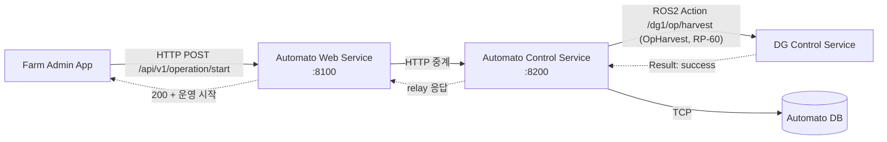

# services 통신 흐름 (VS Code 미리보기로 Mermaid 렌더)

## 확인 포인트
- WEB `/api/v1/operation/start` → **200 + '운영 시작' 로그** (RP-53)
- CTL → DG **OpHarvest** Goal 발행 → **Result 'success'** 수신
- 응답 `relay.dg_result == "success"` 면 Web→Control→DG 전 구간 성립
